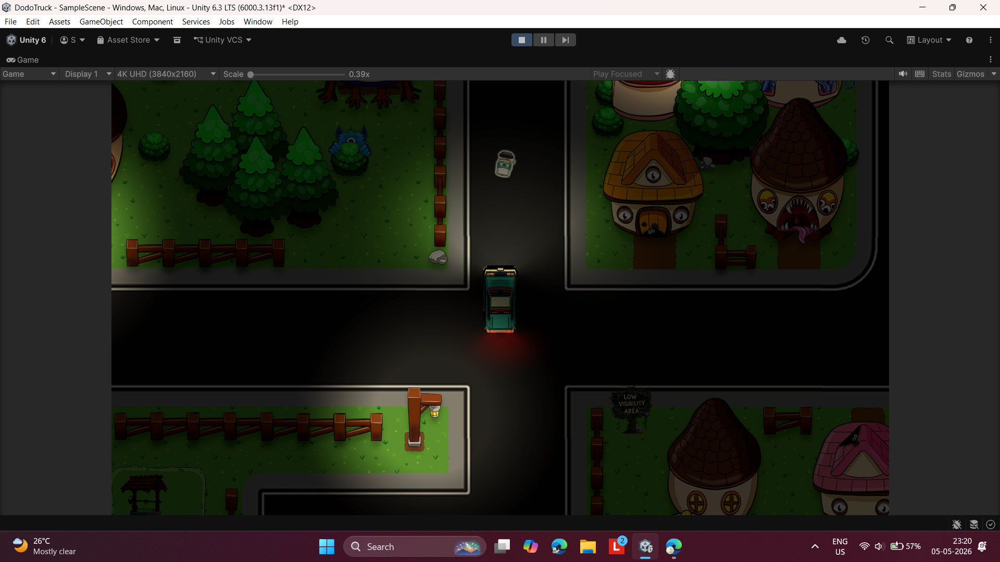
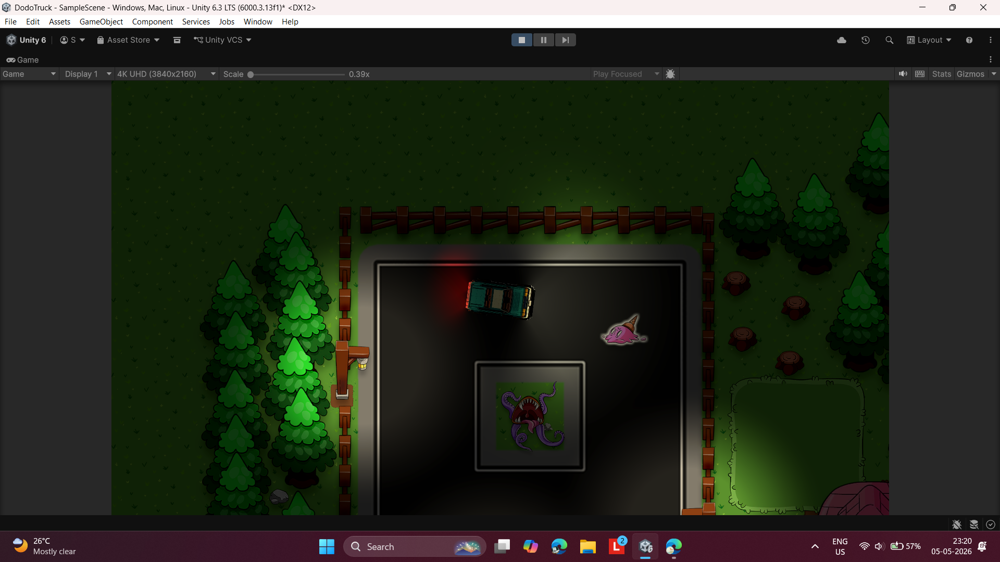
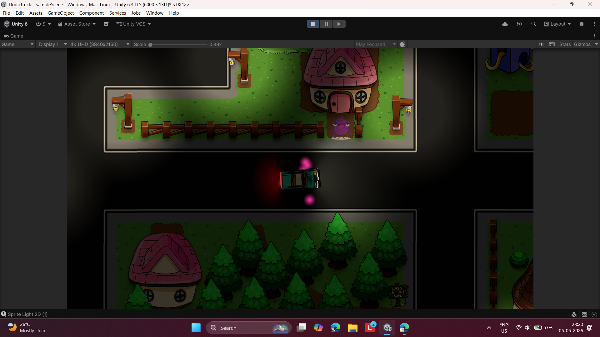
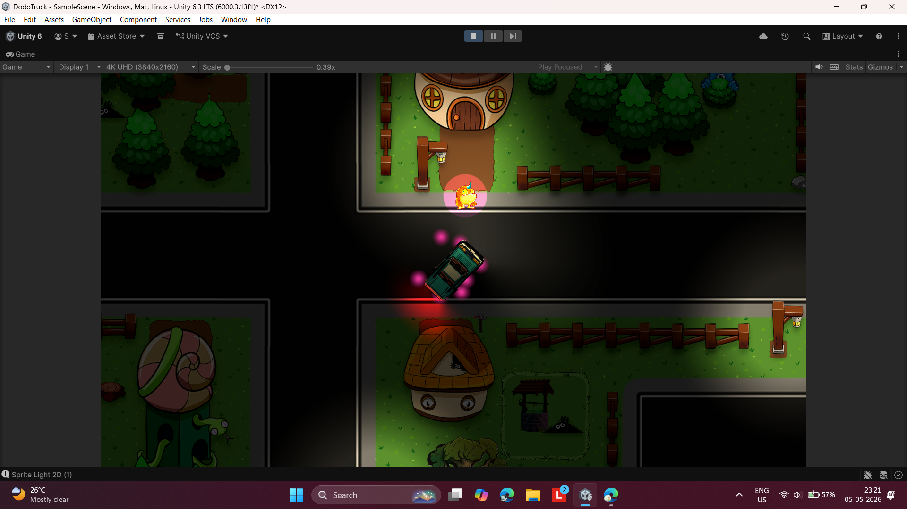

# DodoTruck

A top-down 2D endless delivery game built with Unity 6.3 LTS.

---

## Overview

**DodoTruck** is an endless delivery game where players drive a truck to pick up and deliver orders across a multi-zone world.

* No win condition continuous gameplay loop
* Orders spawn randomly across the map
* Focus on exploration, navigation, and speed management

---

## Core Gameplay

**Loop:**
`Explore → Find Order → Pickup → Deliver → Repeat`

### Key Mechanics

* **Boost Pads:** Increase speed when on road (`OnTriggerEnter2D`)
* **Collisions:** Reset speed on impact (`OnCollisionEnter2D`)
* **Random Orders:** Spawn at unknown locations
* **Low Visibility Zones:** Limited lighting using 2D lights
* **World Zones:** Forest, village, dark areas connected by roads

---

## Screenshots

### 🚧 Crossroad Navigation (Low Visibility)

*Truck navigating a dark intersection with limited light radius.*

---

### 🌲 Forest Zone Exploration

*Dense forest area with obstacles and restricted movement space.*

---

### 📦 Order Pickup Event

*Player approaching an order location marked with visual indicators.*

---

### 🏠 Delivery in Village Zone

*Delivering order to NPC house in the village area.*

---

## Tech Stack

* **Engine:** Unity 6.3 LTS (`6000.3.13f1`)
* **Language:** C#
* **Physics:** Rigidbody2D, Collider2D
* **Lighting:** Sprite Light 2D
* **Platforms:** Windows, macOS, Linux

---

## Getting Started

### Requirements

* Unity Hub
* Unity 6.3 LTS
* Git

### Setup

```bash
git clone https://github.com/YOUR_USERNAME/DodoTruck.git
cd DodoTruck